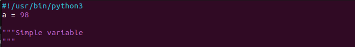
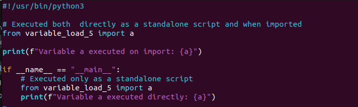
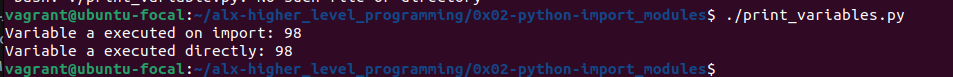
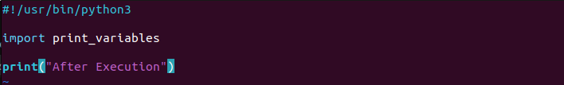
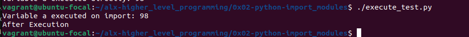

# Import Modules

## Importing modules

When importing a module, the code maybe executed or not. We can write python code that can be used as both a `standalone script` and as a `module` that can be imported into other scripts.

### Standalone Script Execution

> When you run a python script directly from the command line, the special variable `__name__` is set to `__main__`. This indicates that the script is the main program being executed.

### Imported Module Execution

> When you import a Python script as a module into another script, the special variable `__name__` is set tot the name of the module. This indicate that the script is being imported as a module, rather than being executed directly.

### Preventing code from being executed when imported

Checking `if __name__ == "__main__"` allows as to differentiate between a standalone script and an imported module. Any code within this block will only be executed when the script is run directly, not when it's imported as a module.

### Practical example of the above cases.

> Let's have a file `variable_load_5.py` where we'll define a variable and access it from another script:

> Then, we'll have a `print_variables.py` which will import the `variable_load_5` module and access the variable `a`. In this script, we are writing the code to be executed when imported and also as a standalone.

> When we execute the print_variables.py, the variable is printed twice.

> Let's write another script file that just imports the `variable_load_5` module and see what's will be the output.

> On executing `execute_test.py`, the output becomes:

The variable a which was printed on the script file `print_variable.py` inside the `if __name__ == "__main__"` is not printed. This is because, the code inside that block is only executed when the script is executed directly. However, this time the script file is being imported to the `execute_test.py` file and therefore only the first part of the `print_variables.py` was executed. 
